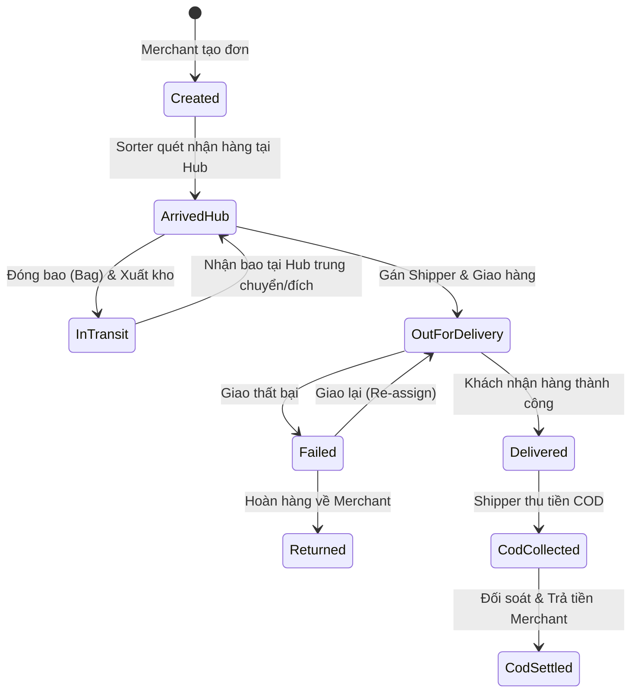

# LWMS COMPLETE PROJECT REPORT (PHASE 1-4)

Báo cáo này cung cấp thông tin tổng thể về hệ thống Logistics Warehouse Management System (LWMS) phục vụ cho việc lập kế hoạch **Full Integration Test**.

## 🏗 1. KIẾN TRÚC HỆ THỐNG (Clean Architecture)
Hệ thống được chia làm 4 lớp chính:
- **Domain**: Chứa thực thể (Parcel, Bag, User...), Enums, và đặc biệt là **State Machine** (trái tim logic).
- **Application**: Chứa Commands/Queries xử lý nghiệp vụ thông qua MediatR.
- **Infrastructure**: Chứa DB Context, Repositories, JWT Service, Serilog.
- **API**: Lớp Controller RESTful, Middleware (Exception, Logging, Auth).

## 🔄 2. QUY TRÌNH LUỒNG ĐƠN HÀNG (Parcel Life Cycle)

Bưu kiện chuyển trạng thái dựa trên các sự kiện vận hành thực tế. Dưới đây là sơ đồ luồng chính:

## 🛠 3. DANH SÁCH API PHỤC VỤ TEST FLOW

### A. Nhóm Merchant (Khởi tạo)
- `POST /api/v1/parcels`: Tạo đơn lẻ.
- `POST /api/v1/parcels/bulk-upload`: Tạo hàng loạt qua CSV.

### B. Nhóm Sorter/Staff (Vận hành Hub)
- `POST /api/v1/inbound`: Sorter quét nhận đơn vào Hub.
- `POST /api/v1/bags`: Tạo túi (Bag) để chuyển vùng.
- `POST /api/v1/bags/scan-inbound`: Nhận túi tại Hub đích.

### C. Nhóm Shipper (Giao hàng)
- `POST /api/v1/assignment`: Admin/HubManager gán Shipper cho đơn.
- `POST /api/v1/bags/delivery-success`: Shipper cập nhật giao thành công (Auto tạo CodRecord).
- `POST /api/v1/returns/fail`: Cập nhật đơn giao lỗi.

### D. Nhóm Tài chính (COD)
- `POST /api/v1/cod/submit`: Shipper nộp tiền về Hub.
- `GET /api/v1/reports/cod-settlement`: Xuất báo cáo đối soát.

## 🛡 4. CÁC ĐIỂM "SENIOR" TRONG LOGIC (Cần Test kỹ)
1. **Idempotency**: Đảm bảo nếu shipper bấm "Giao thành công" 2 lần thì tiền COD chỉ được tạo 1 lần.
2. **State Machine Lock**: Không thể cập nhật "Đã giao" nếu đơn chưa ở trạng thái "Đang đi giao".
3. **Ownership Check**: Shipper A không thể cập nhật đơn của Shipper B.
4. **Amount Matching**: Số tiền nộp COD về Hub phải khớp chính xác với tổng đơn trong danh sách.

## 📝 5. KẾ HOẠCH TEST FLOW GỢI Ý (Happy Path)
1. **B1**: Login Admin -> Tạo Hub, Tạo Merchant, Tạo User (Shipper/Sorter).
2. **B2**: Login Merchant -> Upload CSV tạo 10 đơn hàng.
3. **B3**: Login Sorter -> Quét Inbound 10 đơn vào Hub A.
4. **B4**: Sorter đóng 10 đơn vào Bag B1 -> Chuyển trạng thái sang InTransit.
5. **B5**: Sorter tại Hub B -> Nhận Bag B1 -> Đơn chuyển về ArrivedHub.
6. **B6**: HubManager -> Gán 10 đơn cho Shipper S1.
7. **B7**: Shipper S1 -> Cập nhật Giao thành công 8 đơn, Giao lỗi 2 đơn.
8. **B8**: Admin -> Xem báo cáo COD 8 đơn của Shipper S1 và thực hiện đối soát.

---
**Báo cáo Phase 4 (docx) đã có sẵn tại thư mục gốc của bạn.**
