# 🗄️ LWMS Database — Entity Relationship Diagram

> Sơ đồ liên kết toàn bộ hệ thống Logistics Warehouse Management System.  
> Trung tâm là **Parcel** — mọi thứ xoay quanh vòng đời của bưu kiện.

```mermaid
erDiagram
    %% ═══════════════════════════════════════════
    %% 🔥 PARCEL — TRUNG TÂM HỆ THỐNG
    %% ═══════════════════════════════════════════

    Parcel {
        Guid Id PK
        string TrackingCode UK "Mã vận đơn duy nhất"
        string Sender_Street "VO Address"
        string Sender_Province "VO Address"
        string Sender_District "VO Address"
        string Sender_Ward "VO Address"
        string Receiver_Street "VO Address"
        string Receiver_Province "VO Address"
        string Receiver_District "VO Address"
        string Receiver_Ward "VO Address"
        decimal Weight
        decimal CodAmount_Amount "VO Money"
        string CodAmount_Currency "VO Money"
        ParcelStatus Status "Enum 18 trạng thái"
        int FailCount
        DateTime SlaDate
        Guid MerchantId FK "Merchant sở hữu đơn"
    }

    %% ═══════════════════════════════════════════
    %% 🟦 TRACKING — Lịch sử trạng thái
    %% ═══════════════════════════════════════════

    TrackingLog {
        Guid Id PK
        Guid ParcelId FK "Bưu kiện"
        ParcelStatus FromStatus
        ParcelStatus ToStatus
        Guid ActorId FK "Người thao tác"
        string Location
        string PhotoUrl
        string Note
        DateTime CreatedTime
    }

    %% ═══════════════════════════════════════════
    %% 🟨 BAG SYSTEM — Đóng bao vận chuyển
    %% ═══════════════════════════════════════════

    Bag {
        Guid Id PK
        string BagCode
        Guid FromHubId FK "Hub gửi"
        Guid ToHubId FK "Hub nhận"
        BagStatus Status "Enum"
        DateTime CreatedAt
    }

    BagItem {
        Guid Id PK
        Guid BagId FK "Thuộc Bag nào"
        Guid ParcelId FK "Chứa Parcel nào"
    }

    %% ═══════════════════════════════════════════
    %% 🟩 HUB — Trung tâm kho vận
    %% ═══════════════════════════════════════════

    Hub {
        Guid Id PK
        string HubCode UK
        string Name
        string Address
        string ProvinceCode
        string HubType
        Guid ManagerId FK "User quản lý"
        int Capacity
    }

    %% ═══════════════════════════════════════════
    %% 🟧 USER — Nhân viên và Shipper
    %% ═══════════════════════════════════════════

    User {
        Guid Id PK
        string EmployeeCode UK
        string FullName
        string Phone
        string PasswordHash
        UserRole Role "Enum"
        Guid HubId FK "Thuộc Hub nào"
    }

    %% ═══════════════════════════════════════════
    %% 🟪 MERCHANT — Đối tác gửi hàng
    %% ═══════════════════════════════════════════

    Merchant {
        Guid Id PK
        string MerchantCode UK
        string Name
        string Phone
        string Email
        Guid DefaultHubId FK "Hub mặc định"
        string ApiKey
        bool IsActive
    }

    %% ═══════════════════════════════════════════
    %% 📦 DELIVERY — Phân công giao lấy hàng
    %% ═══════════════════════════════════════════

    ShipperAssignment {
        Guid Id PK
        Guid ParcelId FK "Bưu kiện"
        Guid ShipperId FK "Shipper"
        Guid HubId FK "Hub xuất phát"
        string Type "DELIVERY hoặc PICKUP"
        string Status "ASSIGNED IN_PROGRESS DONE"
        DateTime AssignedAt
    }

    PickupRequest {
        Guid Id PK
        Guid MerchantId FK "Merchant yêu cầu"
        string Address
        DateTime PickupDate
    }

    %% ═══════════════════════════════════════════
    %% 💰 COD — Thu hộ và quyết toán
    %% ═══════════════════════════════════════════

    CodRecord {
        Guid Id PK
        Guid ParcelId FK "Bưu kiện"
        decimal Amount
        bool IsCollected
    }

    CodSettlement {
        Guid Id PK
        Guid MerchantId FK "Merchant nhận tiền"
        Guid ShipperId FK "Shipper nộp tiền"
        decimal TotalCollected
        decimal TotalSubmitted
        decimal TotalSettled
        string Status "PENDING COMPLETED FAILED"
        DateTime CreatedDate
        DateTime SettledDate
    }

    %% ═══════════════════════════════════════════
    %% 🔄 RETURN — Đơn hoàn trả
    %% ═══════════════════════════════════════════

    ReturnOrder {
        Guid Id PK
        Guid ParcelId FK "Bưu kiện gốc"
        string ReturnTrackingCode
        ReturnReason Reason "Enum"
        string Notes
        Guid RequestedById FK "Người yêu cầu"
        string Status "PENDING IN_TRANSIT RETURNED"
    }

    %% ═══════════════════════════════════════════
    %% 🗺️ CONFIG — Cấu hình phí và vùng
    %% ═══════════════════════════════════════════

    Zone {
        Guid Id PK
        string Code UK
        string Name
        string Description
    }

    ServiceType {
        Guid Id PK
        string Code UK
        string Name
        int MaxDays
        decimal BaseFee
        bool IsActive
    }

    FeeConfig {
        Guid Id PK
        Guid ServiceTypeId FK "Loại dịch vụ"
        Guid ZoneId FK "Vùng áp dụng"
        decimal MinWeight
        decimal MaxWeight
        decimal BasePrice_Amount "VO Money"
        decimal ExtraPricePerKg_Amount "VO Money"
        bool IsActive
    }

    %% ═══════════════════════════════════════════
    %% 🏗️ WAREHOUSE — Kệ hàng và vị trí
    %% ═══════════════════════════════════════════

    Rack {
        Guid Id PK
        Guid HubId FK "Thuộc Hub"
        string RackCode UK
        int Capacity
        string RackType
        int CurrentUsage
    }

    ParcelLocation {
        Guid Id PK
        Guid ParcelId FK "Bưu kiện"
        Guid RackId FK "Kệ hàng"
        Guid ActorId FK "Nhân viên scan"
        DateTime InDate
        string Note
    }

    %% ═══════════════════════════════════════════
    %% 📋 SYSTEM — Audit log
    %% ═══════════════════════════════════════════

    AuditLog {
        Guid Id PK
        Guid ActorId "Người thực hiện"
        string ActorRole
        string Action
        string EntityType
        Guid EntityId
        string Changes "JSON"
        string IpAddress
        DateTime CreatedTime
    }

    %% ═══════════════════════════════════════════
    %% 🔗 RELATIONSHIPS
    %% ═══════════════════════════════════════════

    %% ── Parcel là trung tâm ──
    Merchant ||--o{ Parcel : "sở hữu (1-N)"
    Parcel ||--o{ TrackingLog : "lịch sử trạng thái (1-N)"
    Parcel ||--o{ BagItem : "đóng bao (1-N)"
    Parcel ||--o{ ShipperAssignment : "phân công (1-N)"
    Parcel ||--o| CodRecord : "thu hộ (1-1)"
    Parcel ||--o| ReturnOrder : "đơn hoàn (1-1)"
    Parcel ||--o{ ParcelLocation : "vị trí kho (1-N)"

    %% ── Bag system ──
    Bag ||--o{ BagItem : "chứa bưu kiện (1-N)"
    Hub ||--o{ Bag : "gửi đi FromHub (1-N)"
    Hub ||--o{ Bag : "nhận về ToHub (1-N)"

    %% ── Hub là nút mạng lưới ──
    Hub ||--o{ User : "nhân viên (1-N)"
    Hub ||--o{ ShipperAssignment : "phân bổ (1-N)"
    Hub ||--o{ Rack : "kệ hàng (1-N)"

    %% ── User/Shipper ──
    User ||--o{ ShipperAssignment : "giao hàng (1-N)"
    User ||--o{ CodSettlement : "nộp tiền (1-N)"

    %% ── Merchant ──
    Merchant ||--o{ PickupRequest : "yêu cầu lấy (1-N)"
    Merchant ||--o{ CodSettlement : "nhận tiền (1-N)"

    %% ── Fee config ──
    ServiceType ||--o{ FeeConfig : "bảng giá (1-N)"
    Zone ||--o{ FeeConfig : "vùng áp dụng (1-N)"

    %% ── Warehouse location ──
    Rack ||--o{ ParcelLocation : "vị trí kệ (1-N)"
```

## 📊 Tổng kết Relationships

| # | Từ | → Đến | Loại | FK Column |
|---|-----|--------|------|-----------|
| 1 | Merchant | Parcel | 1-N | `Parcel.MerchantId` |
| 2 | Parcel | TrackingLog | 1-N | `TrackingLog.ParcelId` |
| 3 | Parcel | BagItem | 1-N | `BagItem.ParcelId` |
| 4 | Parcel | ShipperAssignment | 1-N | `ShipperAssignment.ParcelId` |
| 5 | Parcel | CodRecord | 1-1 | `CodRecord.ParcelId` |
| 6 | Parcel | ReturnOrder | 1-1 | `ReturnOrder.ParcelId` |
| 7 | Parcel | ParcelLocation | 1-N | `ParcelLocation.ParcelId` |
| 8 | Bag | BagItem | 1-N | `BagItem.BagId` |
| 9 | Hub | Bag (FromHub) | 1-N | `Bag.FromHubId` |
| 10 | Hub | Bag (ToHub) | 1-N | `Bag.ToHubId` |
| 11 | Hub | User | 1-N | `User.HubId` |
| 12 | Hub | ShipperAssignment | 1-N | `ShipperAssignment.HubId` |
| 13 | Hub | Rack | 1-N | `Rack.HubId` |
| 14 | User | ShipperAssignment | 1-N | `ShipperAssignment.ShipperId` |
| 15 | User | CodSettlement | 1-N | `CodSettlement.ShipperId` |
| 16 | Merchant | PickupRequest | 1-N | `PickupRequest.MerchantId` |
| 17 | Merchant | CodSettlement | 1-N | `CodSettlement.MerchantId` |
| 18 | ServiceType | FeeConfig | 1-N | `FeeConfig.ServiceTypeId` |
| 19 | Zone | FeeConfig | 1-N | `FeeConfig.ZoneId` |
| 20 | Rack | ParcelLocation | 1-N | `ParcelLocation.RackId` |

> [!IMPORTANT]
> **Parcel thiếu `MerchantId`** — Entity hiện tại chưa có trường này. Cần bổ sung để biết bưu kiện thuộc Merchant nào (multi-tenant key).

> [!NOTE]
> - `AuditLog` không có FK cứng vì nó ghi log cho MỌI entity type (polymorphic). Dùng `EntityType` + `EntityId` để tra cứu.
> - `Bag.Packages` (navigation property `List<BagItem>`) đang gây conflict shadow FK `BagId1`. Cần fix trong configuration.
